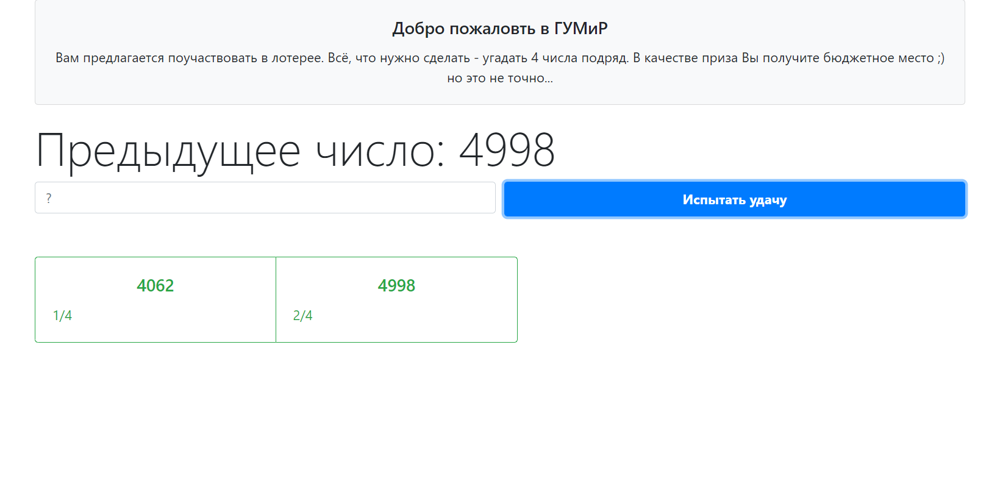
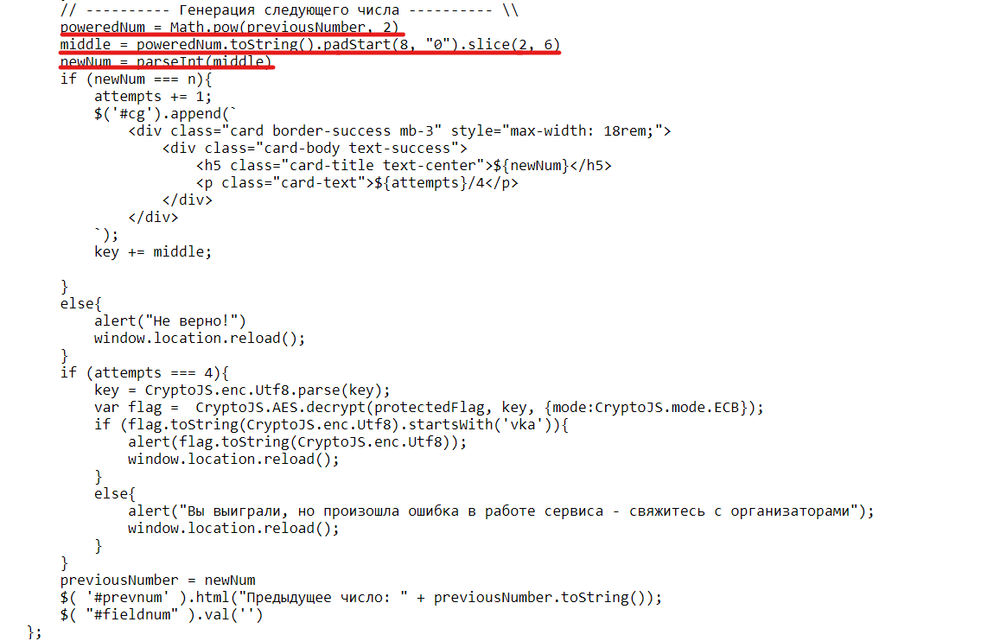

## Лотерея

| Событие | Название | Категория | Сложность |
| :------ | ---- | ---- | ---- |
| VKACTF kids 2022 | Лотерея  | Crypto | Средняя |

  
### Описание


> Автор: iC0nst
>
> Гос. университет мемов и рофлов(ГУМиР) проводит лотерею на бюджетные места на факультет кибербезопасности. Попытайте свою удачу!


### Решение

Имеется веб-приложение для участия в лотерее. 




Если открыть исхожный код страницы, то можно увидеть, что генерация чисел происходит в браузере. 



В данном случае используется метод средних квадратов: берётся число, возводится в квадрат, средние цифры результата используются как следующее число, которое возводится в квадрат и так далее. 

Например, пусть начальное число 4935

4935 * 4935 = 24**3542**25 (следующее: 3542)

3542 * 3542 = 12**5457**64 (следующее: 5457)

5457 * 5457 = 29**7788**49 (сдедующее: 7788)

7788 * 7788 = 60**6529**44 (следующее: 6529)

Ответив 4 раза правильно, сайт вернёт флаг. 

### Флаг

```
vka{lucky_man_knows_maths}
```