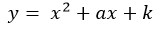
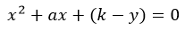
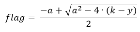

# A. De Saint-Exupery. Маленький ключ

|   Cобытие   | Название | Категория | Сложность |
| :---------: | :------: | :-------: | :-------: |
| VKACTF Kids 2022 |  A. De Saint-Exupery. Маленький ключ |  Криптография  |  Средний  |

## Описание

>Автор: CryptoDjon
>
>Никогда не любил математику... но хорошо, что здесь всего лишь квадратное уравнение. Помогите мне в этом разобраться.

# Решение

Проанализировав исходный файл, составим уравнение: 

Пусть y - зашифрованный флаг, а k - ключ, тогда 





Один из корней уравнения будет являться флагом, очевидно, что он будет не отрицательным. Тогда 



Но для получения флага надо знать k, а в исходном коде указано, что k генерируется от 0 до 10000, что означает, что k можно перебрать. Единственной трудностью станет поиск алгоритма извлечения квадратного корня из большого числа и проверка, подходит k или нет.

После получения флага в виде числа необходимо перевести его в 256-ричную систему, используя таблицу ASCII, то есть реализовать алгоритм, обратный данному в исходном файле.

[Решение](solve.py)

### Флаг


```
vka{bruteforce_is_easy}
```