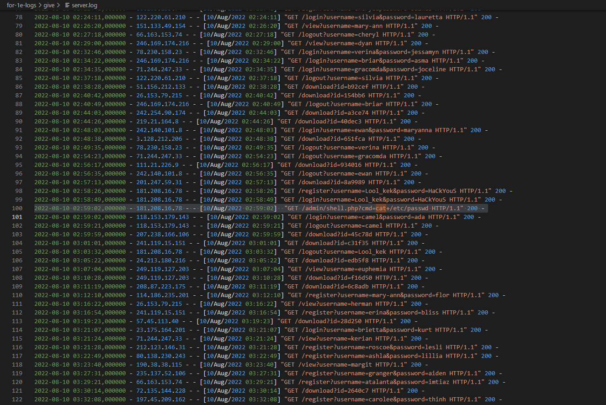
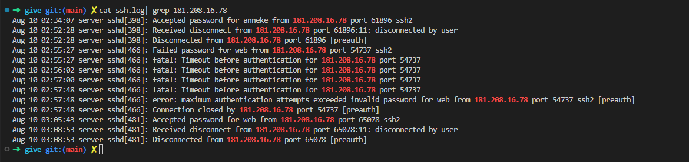

# Мамкин хакер

| Cобытие       | Название       | Категория | Сложность |
|:-------------:|:-------------: |:---------:|:---------:|
| VKAСTF Kids 2022 | Мамкин хакер| Forensics | Easy |

## Описание

>Автор [WaffeSoul]
>
>Какой-то школьник нашел дыру в нашей системе безопасности веб-дневника и получил доступ к админскому пользователю ssh. А у нас есть, логи. Найти это кто-то из наших учеников, так что его ник там точно есть и ip тоже нужно.
>
>
>Формат флага: `vka{ip_username}`
 

# Решение

Нам даны логи от ssh (ssh.log) и веб сервера (server.log). 
В лога веб сервера нужно найти атаку на сервер. Есть два варианта как найти нужный лог: 
1. Найти не обычный запрос, для этого нужно убрать обычные запросы типа /login, /register, /download, /logout, /view.
2. Сюда по заданию хакер получился доступ к паролям от админа возможно через файлы shadow или passwd. Ищем их в server.log.

Находим запрос /admin/shell.php?cmd=cat+/etc/passwd.



Берем ip 181.208.16.78. Находим все строки в ssh.log. С помощью команды cat ssh.log| grep 181.208.16.78



В логах можно увидеть двух полььзовательей anneke и web, которым подключались. К web были 2 попытки и если смотреть по времени, то вторая была после получение доступа к веб серверу. Значит имя нашего хакера anneke.
### Флаг
```
vka{181.208.16.78_anneke}
```
