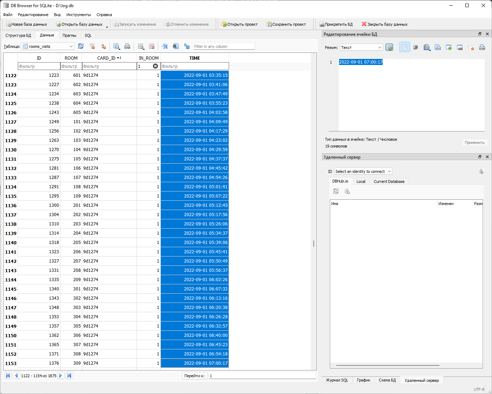

# Система безопасности

| Cобытие       | Название       | Категория | Сложность |
|:-------------:|:-------------: |:---------:|:---------:|
| VKAСTF Kids 2022 |Система безопасности| Forensics | Medium |

## Описание

>Автор [WaffeSoul]
>
>Недавно наша сотрудница уволилась и перешла в компанию контр-агента... Мы до сих пор надеемся, что она не разболтал нашу коммерческую тайну, но! Недавний инцидент, который заметил охранник, все больше ставит под сомнение ее благоразумие! За 1 день он побывал во всех аудиториях с помощью одной ключ-карты. Найдите имя, номер ключ-карты и время, когда она пришла на работу!
>
>Флаг: `vka{name_idkey_timesecond}`" 


# Решение

Для решения понадобиться [DB Browser for SQLite](https://sqlitebrowser.org/), чтобы открыть log.db.


Чтоб решить task нужно разобраться, что содержится в базе данных и как происходят записи в неё. В базе есть 4 таблицы:
1. users - таблица всех сотрудников компании. 

Содержит 2 столбца: ID и name(ФИО сотрудника). Всего 32 сотрудника.
2. visits - таблица входа и выхода сотрудников из здaния.

Содержит 4 столбца: ID, user_id(id из таблицы users), in_base(1 - вход в задние и 0 - выход из здания), time(время в unix-дата)
3. card_key - таблица ключ-карт

Содержит 5 столбцов: ID, card_id (уникальный id карты), user_id(id из таблицы users, который взял ключ-карту), get_card(1 - получения карты и 0 - возращения карты), time(время в unix-дата)
4. room_visits - таблица посещения комнат

Содержит 5 столбцов: ID, room(номер комнаты), card_id (уникальный id карты, которым воспользовались для входа или выхода из комнаты), user_id(id из таблицы users), in_room(1 - вход в комнату и 0 - выход из комнаты), time(время в unix-дата).

Алгоритм действий одного человека:
1. Пришел в здания - запись в таблицу visits с временим входа.
2. Получил случайную ключ-карту - запись в таблицу card_keys с временим получения.
3. Посещение комнат - записи в таблицу rooms_visits с временим захода и выхода в комнату. При этом указывается не user_id человека, который заходил, а id ключ-карты.
4. В конце для человек сдает ключ-карту - запись в таблицу card_keys с временим сдачи.
5. Уходит из здания  - запись в таблицу visits с временим выхода.

Из описания задания и разбора базы данных понимает, что нужно сделать несколько этапов:
1. Найти id_card, которой открыли все комнаты(room) из таблицы room_visits.
2. Найти id_user, который получил эту ключ-карту(id_card) в этот день в таблице card_keys.
3. Найти запись, когда это id_user пришел в это день на работу.
4. Соотнести id_user с name в таблице users. 

Дальше можно решать двумя способами: 
1. Вручную.

    Для решения нужно узнать количество комнат. В таблицы room_visits отсортировать по столбцу room и посчитать в ручную количество комнат.

    Узнаем, что комнат всего 32.

    Далее ищем id_card. 
    
    В таблицы room_visits отсортировать по столбцу card_id, смотрим когда за одни день будет 32 комнаты у одной card_id. 
    
    Также для упрощения поиска, можно изменить отображение TIME на UNIX-дата. А в IN_ROOM поставить фильтр на 1 или 0. Это будем использовать во всех этапах решения.


    

    Получаем, что ключ-картой 9d1274 открывали все 32 кабинета 1 сентября. 

    Далее ищем id_user по id_card и по дате в таблице card_key. Используем фильтры.

    

    id_user 12. Ищем дату в таблице visits. Чтоб получить в timesecond возвращаем отображение по умолчанию.
    

    Время 1662002861 прихода.

    Смотрим имя сотрудника в таблице users.
    
    Имя Diana Gutierrez.

    Складываем все и получаем флаг:

    >vka{Diana_Gutierrez_9d1274_1662002861}


2. С помощью SQL.  
    Переходим во вкладку SQL:

    Чтобы понять, что одной ключ-картой открыли все комнаты нужно найти количество комнат. С помощью SQL-запроса получаем, что комнат 32.
    >SELECT DISTINCT ROOM  FROM rooms_visits;

    
    

    Выведем количество посещенных комнат для каждой карты в каждый день и отсортируем по количеству 

    >SELECT CARD_ID, date("TIME", 'unixepoch'), COUNT(*) FROM rooms_visits WHERE IN_ROOM = 0 GROUP BY CARD_ID, date("TIME", 'unixepoch') ORDER BY COUNT(*) DESC;

    

    Получаем, что ключ-картой 9d1274 открывали все 32 кабинета 2022-09-01. 

    Находим id_user в таблице card_id:

    > SELECT * FROM card_keys WHERE date("TIME", 'unixepoch') = "2022-09-01" and CARD_ID = "9d1274";

    

    Получаем id_user - 12:

    Далее ищем, когда он пришел:

    > SELECT * FROM visits WHERE date("TIME", 'unixepoch') = "2022-09-01" and USER_ID = "12" and IN_BASE = 1;

    

    И по user_id находим её имя:

    > SELECT * FROM users WHERE ID = "12";

    

    > vka{Diana_Gutierrez_9d1274_1662002861}


### Флаг
```
vka{Diana_Gutierrez_9d1274_1662002861}
```
