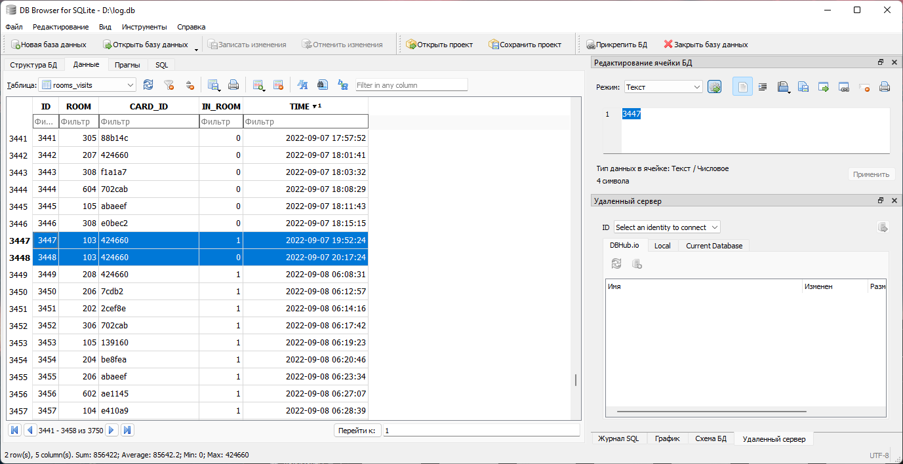
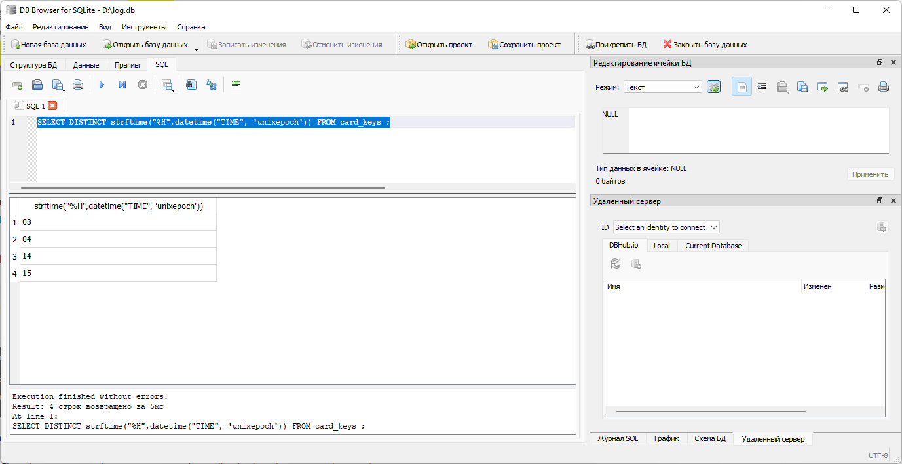
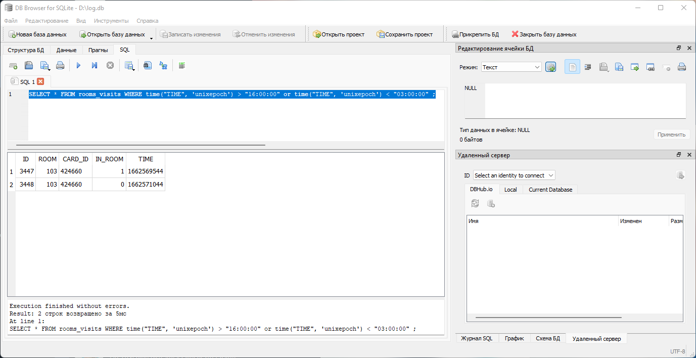

# Система безопасности 2

| Cобытие       | Название       | Категория | Сложность |
|:-------------:|:-------------: |:---------:|:---------:|
| VKAСTF Kids 2022 |Система безопасности 2| Forensics | Medium |

## Описание

>Автор [WaffeSoul]
>
> "Наша компания работает с 09:00 до 17:30. Недавно ночью мне пришло сообщение от охранника, но я не успел его прочитать: он его сразу удалил. Я подозреваю, что что-то произошло. Проверьте мою догадку. Ответом будет являться номер комнаты и ключ-карты, которой была открыта комната
>
>Флаг: `vka{idroom_idkey}`" 


# Решение

Разбор базы данных находиться в решении [Система безопасности](../../for-2m-sqlite/solution/writeup.md)

По формату флага ясно, что нам нужно найти странное происшествие связанное с ключ-картой и комнатой, вероятнее всего это вход и\или выход. А учитываю, что говорится о ночи, то в заднии никого не должно быть и все ключ карты должны быть сданы. То есть нужно найти окрытие комнаты, когда все ключ-карты сданы.

Время указано в UTC формате, нужно прибавить 3 часа, но и без этого все можно решить.

Варианты решения:

1. В таблице card_keys сортируем по времени и смотрим крайнее время сдачи ключ-карты каждый день и ранее время получения ключ-карты. Всегда оно с 03:00 (06:00 по Москве) до 16:00 (19:00 по Москве).

    Ищем время в таблице rooms_visits, которое не входит в этот порог.

    

    Получаем флаг.


2. Во вкладке SQL.

    Так как ключ-карты получают утром, а сдают вечером, время получения и сдачи примерно одно и тоже каждый день. Потому SQL-запросам смортим часы получения.

    > SELECT DISTINCT strftime("%H",datetime("TIME", 'unixepoch')) FROM card_keys ;
    

    Время самого раннего получения не может превышать  03 часов, а время сдачи 16 часов (хоть на скриншоте 15 часов, но там еще были минуты поэтому крайнее время 16). Далее SQL-запросом смотрим время, которое не попадает в этот промежуток. 

    > SELECT * FROM rooms_visits WHERE time("TIME", 'unixepoch') > "16:00:00" or time("TIME", 'unixepoch') < "03:00:00";
     (Время "16:00:00" и "03:00:00" может менять в зависимости от первого запроса)

    
    Получаем флаг

### Флаг
```
vka{103_424660}
```
