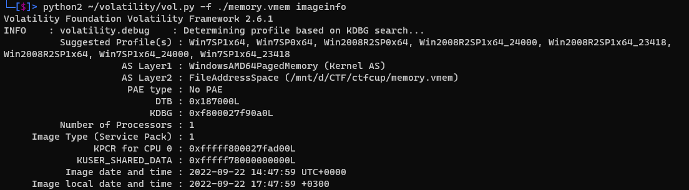
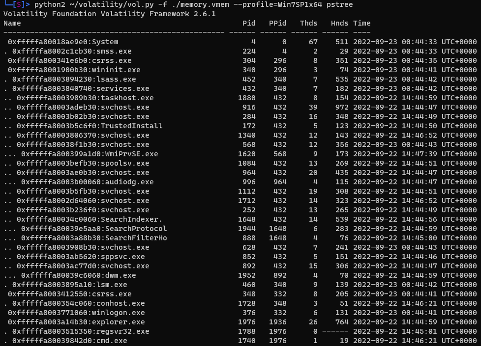
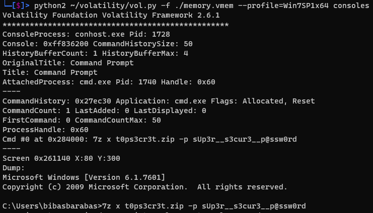

# Top Secret

| Cобытие       | Название       | Категория | Сложность |
|:-------------:|:-------------: |:---------:|:---------:|
| VKAСTF Kids 2022 | Top Secret| Forensics | Medium |

## Описание

>Автор [b1bas]
>
>Наши специалисты достали из трафика подозрительный архив. Архив шел недавно пойманному хакеру Sl@v1k_1337. Вот дамп памяти с его компьютера, разберись с этим! 


Пароль от архива: `485bb73e83d5a5c8fabc556c4a3c062a`


[Yandex Drive](https://disk.yandex.ru/d/I7Q1ZtlF0FKAeg)
[Google Drive](https://drive.google.com/file/d/1joNUYGP8VwWqUgHr7m4zsmhgPufPEMpq/view?usp=sharing)

# Решение

Дан дамп памяти Windows 7, это можно узнать благодаря Volatility - фреймворк для работы с дампами памяти, написанный на Python и запароленный архив. Существует две версии Volatility: 2 (написана на python2) и 3 (написана на python3)

Будут разобраны два варианта решения (для volatility2 и volatility3)

Узнать информацию о системе можно выполнив команду:
```code
python2 ~/volatility/vol.py -f ./memory.vmem imageinfo
```
или
```code
python3 ~/volatility3/vol.py -f ./memory.vmem windows.info
```


С помощью команд:
```code
python2 ~/volatility/vol.py -f ./memory.vmem --profile=Win7SP1x64 pstree
```
или
```code
python3 ~/volatility3/vol.py -f ./memory.vmem windows.pstree.PsTree
```
Можно узнать список процессов в удобном древовидном формате:



На данном скрине мы видим, что процесс 1976 (explorer.exe) запускает 1740 (cmd.exe)

И тут встречается проблема: в то время, как в volatility 2 есть модуль ```consoles```, в volatility 3 есть только модуль ```cmdline```, который никак нам не поможет. Кто-то скажет, что все равно все пишется в процесс ```conhost``` (или ```csrss```), но сколько бы я не пытался найти там хоть намек на ```t0ps3cr3t.zip``` - не нашел. Поэтому в любом случае придется использовать volatility2:


```code
python2 ~/volatility/vol.py -f ./memory.vmem --profile=Win7SP1x64 consoles
```


Найдя пароль от архива можно открыть файл ```flag.txt```, и получить заветный флажок
### Флаг
```
vka{waow_volatility_was_too_easy_for_you}
```
