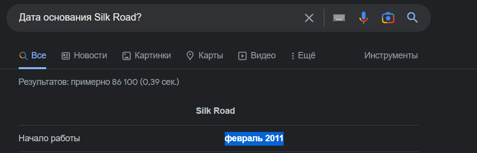
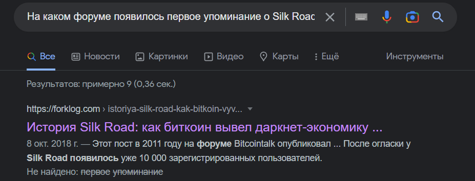
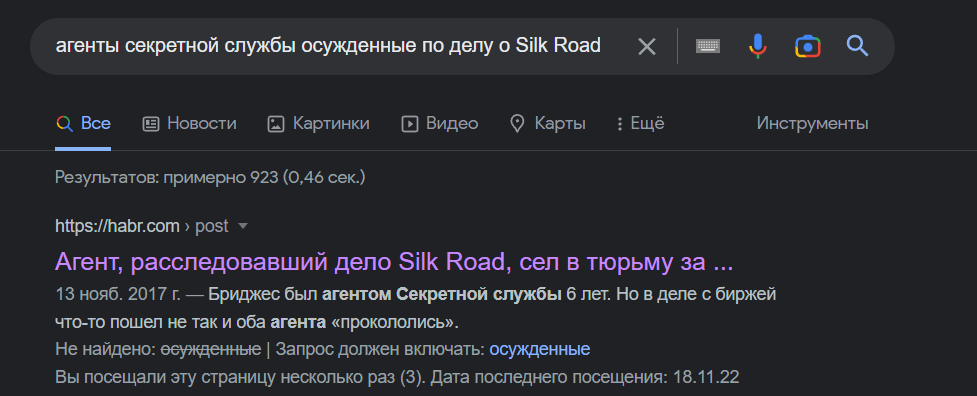
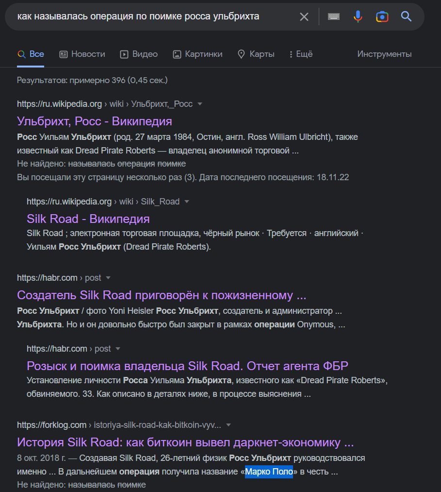
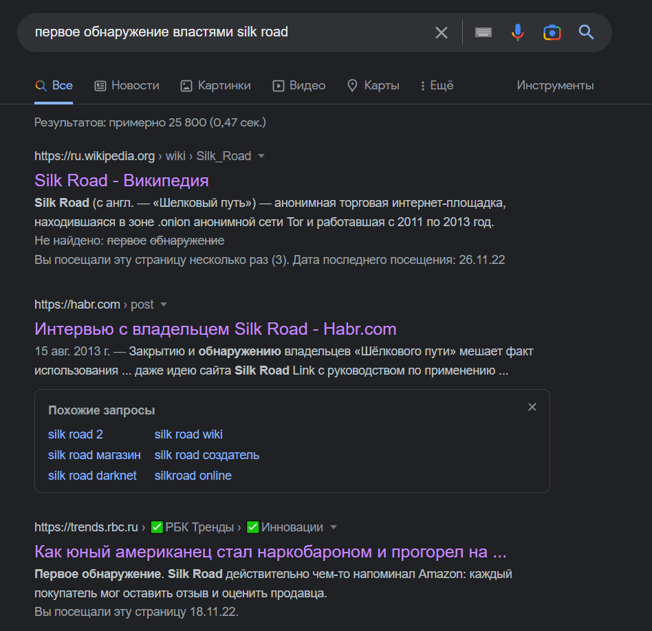
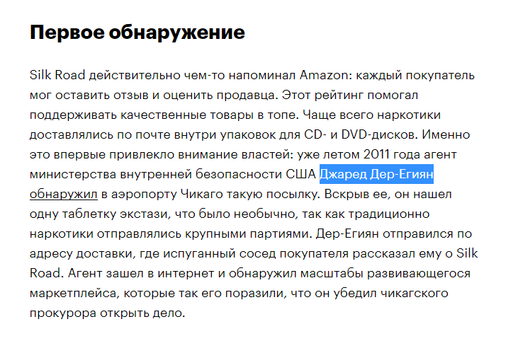

# Top Secret

| Cобытие       | Название       | Категория | Сложность |
|:-------------:|:-------------: |:---------:|:---------:|
| VKAСTF Kids 2022 | Silk Road| Osint | Hard |

## Описание

>Автор [b1bas]
>
>Росс Ульбрихт породил зло, которое живет и по сей день. Ответьте на вопросы, находящиеся на этом [сайте](https://silkroad.vkactf.ru), и получите флаг

# Решение

На сайте висят 5 заданий, при ответе на которые выдаются части флага.

1. Ответ на 1ый вопрос можно нагуглить прямо полностью скопировав его в поисковую строку гугла:

2. На второй вопрос гугл уже не выдает свои результаты, но прямо в первой ссылке можно встретить `Bitcointalk`

3. Вообще, в деле о Silk Road фигурировало 2 "нечистых" агента - Карл Форс и Шон Бриджес.
Карл Форс свое наказание отбыл, а вот Шону Бриджесу не так давно добавили срок на 2 года.
Тут уже надо было немного перестроить запрос в гугле:

4. Чуть-чуть перестроив запрос, получаем ответ в 3ей ссылке гугла:

5. Самый тяжелый вопрос из всех. Тут скорее надо искать информацию не о конкретном человеке, а вообще в целом об обнаружении властями. На третьей ссылке мы найдем ответ:



Кому интересна данная история и как был пойман Росс Ульбрихт - советую почитать книгу Ника Билтона "Киберпреступник №1". Когда я только поступил в ВУЗ, она мне очень помогла разобраться с тем, что я хочу (не подумайте, я хочу расследовать инциденты, а не заниматься грязными делишками ;)))

### Флаг
```
vka{hope_you_enjoy_story_about_silk_road}
```
