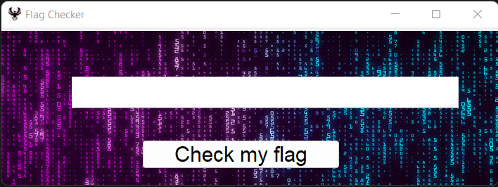
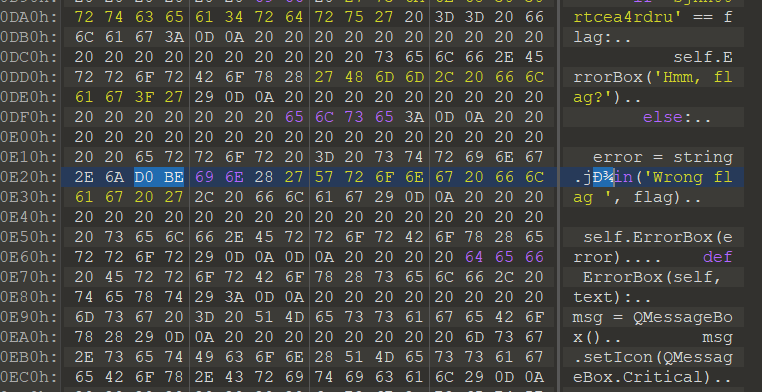

# Trojan

|   Cобытие   | Название | Категория | Сложность |
| :---------: | :------: | :-------: | :-------: |
| VKACTF Kids 2022 |  Trojan |  Обратная разработка  |  Сложно  |

## Описание

>Автор: Rex
>
>Хочешь стать киберпиратом?) Попробуй обойти лицензию нашего FlagChecker !!!
>При сдаче флага добавьте vka{*}

# Решение

Нам даны исходные коды FlagChecker



Итак, проверка флага осуществляется в функции check_flag, в файле gui.py.

Флаг состоит из символов верхнего и нижнего регистров, цифр

```python
alphabet =  string.ascii_lowercase + \
            string.ascii_uppercase + \
            string.digits
```

Длина флага = 16

```python
elif len(self.lineEdit.text()) != 16:
    self.ErrorBox('Wrong length')
```
Для удобства лучше добавлять print(flag) после каждого этапа в magic

```python
def magic(flag):
    flag = leftshift(flag)
    print(flag)
    flag = swap2(flag)
    print(flag)
    flag = leftshift(flag)
    print(flag)
    flag = swap4(flag)
    print(flag)
    flag = leftshift(flag)
    print(flag)
    f = ''
    f += change(list(flag[0:8]))
    f += change(list(flag[8:]))
    flag = f
    print(flag)
    return flag
```

Попробуем ввести 16 различных символов, например **0123456789ABCDEF**

Получаем следующий вывод

123456789ABCDEF0
9ABCDEF012345678
ABCDEF0123456789
6789EF012345ABCD
789EF012345ABCD6
901827EF5CD463AB

Таким образом, можем заметить, что функция просто перемешивает наш ввод и после этого сравнивает его со строкой **sjnh00rtcea4rdru**

Всю перестановку можно свести к следующим заменам

```python
endflag[0] = flag[9]
endflag[1] = flag[0]
endflag[2] = flag[1]
endflag[3] = flag[8]
endflag[4] = flag[2]
endflag[5] = flag[7]
endflag[6] = flag[14]
endflag[7] = flag[15]
endflag[8] = flag[5]
endflag[9] = flag[12]
endflag[10] = flag[13]
endflag[11] = flag[4]
endflag[12] = flag[6]
endflag[13] = flag[3]
endflag[14] = flag[10]
endflag[15] = flag[11]
```

Обратной операцией будет

```python
flag[9]  = endflag[0]
flag[0]  = endflag[1]
flag[1]  = endflag[2]
flag[8]  = endflag[3]
flag[2]  = endflag[4]
flag[7]  = endflag[5]
flag[14] = endflag[6]
flag[15] = endflag[7]
flag[5]  = endflag[8]
flag[12] = endflag[9]
flag[13] = endflag[10]
flag[4]  = endflag[11]
flag[6]  = endflag[12]
flag[3]  = endflag[13]
flag[10] = endflag[14]
flag[11] = endflag[15]
```

Делаем обратную перестановку и получаем строку **jn0d4cr0hsrueart**,  пробуем сдать её как флаг и...ничего не получается

Продолжаем смотреть сорцы, можем заметить, что сообщение об ошибке перед выводом обрабатывается в string, ищем среди библиотек **string** и находим функцию **join**

```python
def join(arg1, arg2):
    """
    The join() method returns a new array consisting of the array 
    it was called on, concatenated with other arrays and/or 
    values passed as arguments.
    """
    return arg1 + arg2
```

Вроде бы все хорошо, но если мы изучим код, то обнаружим еще одну функцию **join**. И если мы внимательно посмотрим на вид **join** в хексах, то заметим, что символ "**о**" имеет другую кодировку.

```python
def jоin(arg1, arg2):
    f = arg2[12:14] + arg2[8:10]  + arg2[4:6] + arg2[0:2] +\
        arg2[14:16] + arg2[10:12] + arg2[6:8] + arg2[2:4]
    print(f)
    if 'sjnh00rtcea4rdru' == f:
        return 'Good, valid license!'
    else:
        return arg1 + arg2
```



Вот теперь у нас есть весь код для восстановления флага.

Делаем обратную перестановку и получаем настоящий флаг

```python
a = 'sjnh00rtcea4rdru'
endflag = a[6:8]+ a[14:16] + a[4:6] + a[12:14] + a[2:4] + a[10:12] + a[0:2] + a[8:10]
flag[9]  = endflag[0]
flag[0]  = endflag[1]
flag[1]  = endflag[2]
flag[8]  = endflag[3]
flag[2]  = endflag[4]
flag[7]  = endflag[5]
flag[14] = endflag[6]
flag[15] = endflag[7]
flag[5]  = endflag[8]
flag[12] = endflag[9]
flag[13] = endflag[10]
flag[4]  = endflag[11]
flag[6]  = endflag[12]
flag[3]  = endflag[13]
flag[10] = endflag[14]
flag[11] = endflag[15]
```


### Флаг


```
vka{tr0j4ns0urcehard}
```
